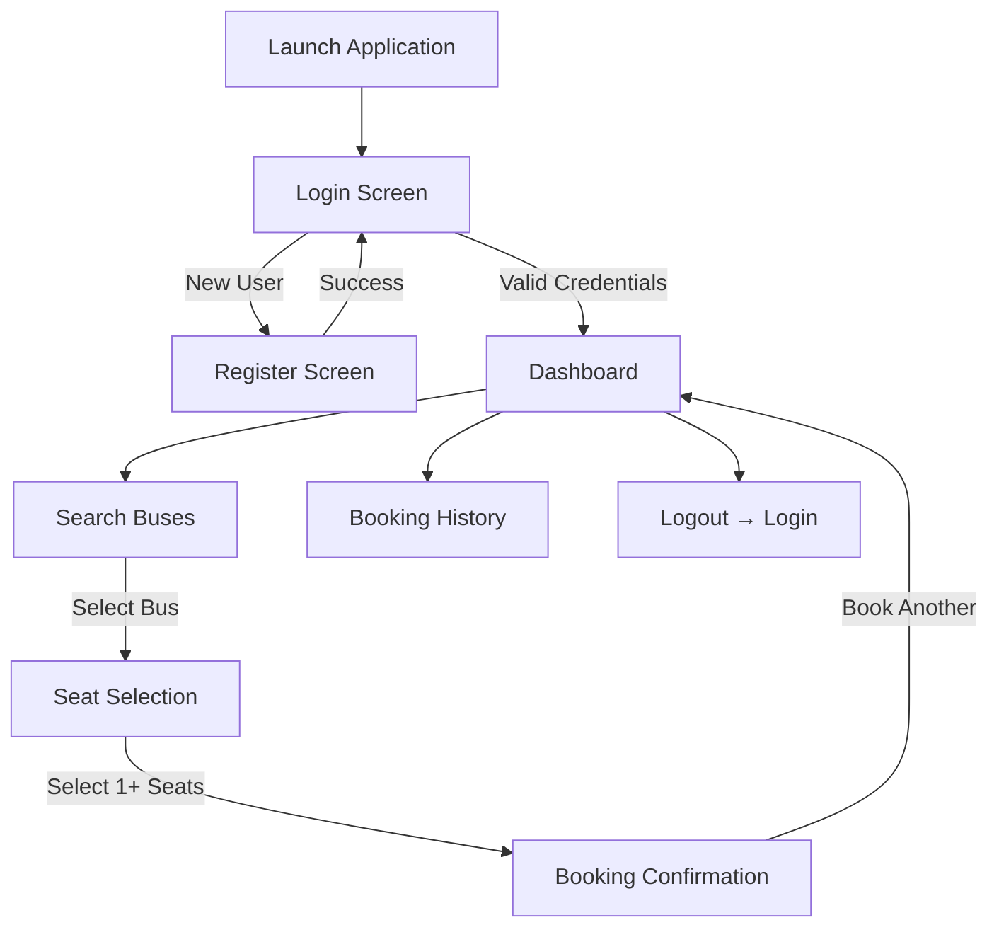
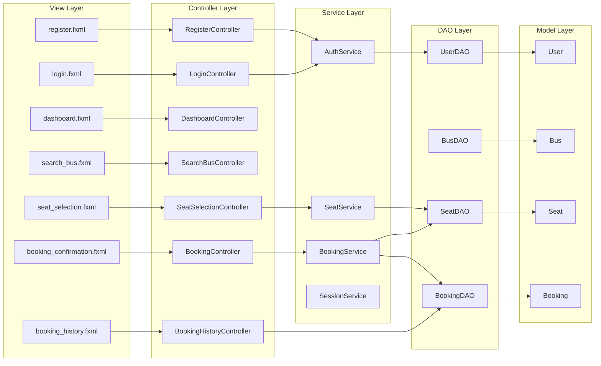

# 🚌 Bus Ticket Booking System — Project Walkthrough

> A comprehensive overview for presentation purposes

---

## Slide 1 — Title

### Bus Ticket Booking System
**A Desktop Application using Java, JavaFX & MySQL**

**Subject:** Advanced Java Programming
**Technologies:** Java 21 · JavaFX · JDBC · MySQL

---

## Slide 2 — Introduction to Topic

### What is a Bus Ticket Booking System?

A **desktop-based application** that allows passengers to search for buses, select seats, and book tickets — all through a graphical user interface.

### Problem Statement
Manual bus ticket booking is time-consuming, error-prone, and lacks a centralized record. There is a need for a digital solution that provides:
- **User authentication** (login & registration)
- **Bus search** by source and destination
- **Real-time seat availability** with visual seat map
- **Multi-seat booking** in a single transaction
- **Booking history** for each user

### Key Highlights
| Feature | Description |
|---------|-------------|
| Dark-themed UI | Premium dark interface with indigo accents |
| MVC Architecture | Clean separation of Models, Views, Controllers |
| Multi-seat booking | Select and book multiple seats at once |
| Session management | Persistent user identity across all screens |
| Transactional booking | Atomic database operations — all-or-nothing |

---

## Slide 3 — Process (Application Flow)

### How the Application Works



### Step-by-Step Flow

1. **Login / Register** — User enters email & password; new users can register
2. **Dashboard** — Central hub with 4 options: Search, Book, History, Logout
3. **Search Buses** — Enter source & destination to find available buses
4. **Seat Selection** — Visual seat grid (2+2 layout with aisle). Click to select/deselect multiple seats
5. **Booking Confirmation** — Seats are atomically booked in the database; confirmation with booking ID, route, seats, and fare is displayed
6. **Booking History** — View all past bookings in a table

---

## Slide 4 — Files & Libraries Used

### Project Structure

```
Bus-Ticket-Booking-System/
├── src/main/java/com/busbooking/
│   ├── app/
│   │   └── Main.java                    ← Entry point
│   ├── controller/
│   │   ├── LoginController.java         ← Login logic
│   │   ├── RegisterController.java      ← Registration logic
│   │   ├── DashboardController.java     ← Dashboard navigation
│   │   ├── SearchBusController.java     ← Bus search & table
│   │   ├── SeatSelectionController.java ← Multi-seat selection
│   │   ├── BookingController.java       ← Booking confirmation
│   │   └── BookingHistoryController.java← Past bookings table
│   ├── dao/
│   │   ├── UserDAO.java                 ← User CRUD
│   │   ├── BusDAO.java                  ← Bus queries
│   │   ├── SeatDAO.java                 ← Seat availability
│   │   └── BookingDAO.java              ← Booking CRUD
│   ├── model/
│   │   ├── User.java                    ← User entity
│   │   ├── Bus.java                     ← Bus entity
│   │   ├── Seat.java                    ← Seat entity
│   │   └── Booking.java                 ← Booking entity
│   ├── service/
│   │   ├── AuthService.java             ← Authentication logic
│   │   ├── BookingService.java          ← Transactional booking
│   │   ├── SeatService.java             ← Seat availability
│   │   └── SessionService.java          ← Global user session
│   ├── util/
│   │   └── DBConnection.java            ← JDBC connection
│   └── exception/
│       └── BookingException.java        ← Custom exception
├── src/main/resources/
│   ├── fxml/                            ← 7 FXML layouts
│   └── css/style.css                    ← Dark theme stylesheet
├── databaseTables.sql                   ← Schema creation
├── seed_data.sql                        ← Sample data (15 Indian routes)
└── compile.ps1                          ← Build & run script
```

### Libraries & Technologies

| Library | Purpose | Version |
|---------|---------|---------|
| **Java** | Core programming language | 21 |
| **JavaFX** | GUI framework (FXML + CSS) | 21 |
| **JDBC** | Database connectivity API | Built-in |
| **MySQL Connector/J** | MySQL JDBC driver | 8.x |
| **MySQL** | Relational database | 8.x |

### Tools Used
- **IDE:** Any Java IDE (VS Code, IntelliJ, Eclipse)
- **Database:** MySQL via WAMP/XAMPP
- **Build:** PowerShell compile script (`compile.ps1`)

---

## Slide 5 — Modules

### Architecture: Model-View-Controller (MVC)



### Module Descriptions

| Module | Responsibility |
|--------|---------------|
| **View (FXML + CSS)** | Defines the UI layout and styling. No logic — purely declarative |
| **Controller** | Handles user events (button clicks, form submissions), coordinates between View and Service |
| **Service** | Business logic layer — authentication, transaction management, session state |
| **DAO** | Data Access Objects — direct SQL queries via JDBC. Each DAO maps to one database table |
| **Model** | Plain Java objects (POJOs) representing database entities: User, Bus, Seat, Booking |
| **Utility** | `DBConnection` for JDBC connection management, `BookingException` for typed errors |

---

## Slide 6 — Code

### Key Code Snippets

#### 1. Database Connection (`DBConnection.java`)
```java
public class DBConnection {
    private static final String URL =
        "jdbc:mysql://localhost:3306/bus_ticket_booking_db";
    private static final String USER = "root";
    private static final String PASSWORD = "";

    public static Connection getConnection() throws SQLException {
        return DriverManager.getConnection(URL, USER, PASSWORD);
    }
}
```

#### 2. User Authentication (`UserDAO.java`)
```java
public User authenticate(String email, String password) {
    String sql = "SELECT * FROM users WHERE email = ? AND password = ?";
    try (Connection conn = DBConnection.getConnection();
         PreparedStatement ps = conn.prepareStatement(sql)) {
        ps.setString(1, email);
        ps.setString(2, password);
        try (ResultSet rs = ps.executeQuery()) {
            if (rs.next()) {
                return new User(
                    rs.getInt("user_id"),
                    rs.getString("name"),
                    rs.getString("email"),
                    rs.getString("password"));
            }
        }
    }
    return null;
}
```

#### 3. Multi-Seat Booking — Atomic Transaction (`BookingService.java`)
```java
public List<Integer> bookSeats(int userId, int busId,
        List<Integer> seatNumbers, LocalDate travelDate)
        throws BookingException {

    Connection conn = DBConnection.getConnection();
    conn.setAutoCommit(false);

    // Check ALL seats are available first
    for (int seat : seatNumbers) {
        if (!seatDAO.isSeatAvailable(busId, seat))
            throw new BookingException("Seat " + seat + " is taken.");
    }

    // Book all seats atomically
    List<Integer> bookingIds = new ArrayList<>();
    for (int seat : seatNumbers) {
        int id = bookingDAO.createBooking(conn, userId, busId, seat, travelDate);
        seatDAO.markSeatBooked(conn, busId, seat);
        bookingIds.add(id);
    }

    conn.commit(); // All-or-nothing
    return bookingIds;
}
```

#### 4. Session Management (`SessionService.java`)
```java
public class SessionService {
    private static int userId = -1;
    private static String userName = null;

    public static void startSession(int id, String name) {
        userId = id;
        userName = name;
    }

    public static boolean isLoggedIn() { return userId != -1; }
    public static int getUserId()      { return userId; }
    public static String getUserName() { return userName; }

    public static void endSession() {
        userId = -1;
        userName = null;
    }
}
```

#### 5. Seat Toggle — Multi-Select UI (`SeatSelectionController.java`)
```java
private void toggleSeat(Button clickedButton, int seatNumber) {
    if (selectedSeats.contains(seatNumber)) {
        selectedSeats.remove(Integer.valueOf(seatNumber));
        clickedButton.getStyleClass().remove("seat-selected");
        clickedButton.getStyleClass().add("seat-available");
    } else {
        selectedSeats.add(seatNumber);
        clickedButton.getStyleClass().remove("seat-available");
        clickedButton.getStyleClass().add("seat-selected");
    }
    updateSelectionLabel();
}
```

---

## Slide 7 — Code Explanation

### How the Key Components Work Together

#### 🔐 Authentication Flow
1. User enters email + password on the **Login screen**
2. `LoginController` calls `AuthService.login()` which queries `UserDAO.authenticate()`
3. If credentials match a database row → `SessionService.startSession()` stores userId & name
4. Dashboard loads and reads the name from `SessionService` for the welcome message
5. **Registration** follows the same pattern — `AuthService.register()` checks for duplicate email via `UserDAO.emailExists()`, then inserts via `UserDAO.registerUser()`

#### 🎟 Booking Flow (Multi-Seat)
1. User searches buses by route → `BusDAO.searchBuses()` returns matching records
2. Selects a bus → navigates to **Seat Selection** screen
3. `SeatService.getSeatAvailability()` loads seat map from database
4. User **clicks multiple seats** to toggle selection (stored in `List<Integer>`)
5. On confirm → `BookingService.bookSeats()`:
   - Opens a single DB connection
   - Disables auto-commit (`conn.setAutoCommit(false)`)
   - Validates all seats are available
   - Creates a booking record + marks each seat booked
   - **Commits** the transaction (if any step fails → **rollback all**)
6. Confirmation screen shows all booking IDs, seats, and total fare (₹400 × seat count)

#### 🎨 Styling Architecture
- All styling is in a **single CSS file** (`style.css`) — no inline styles in FXML
- Uses **JavaFX CSS** (prefixed with `-fx-`) — similar to web CSS but for desktop
- CSS variables define a **design token** system for consistent colors
- Seat states use distinct style classes: `seat-available`, `seat-booked`, `seat-selected`

#### 🗄️ Database Design

| Table | Columns | Purpose |
|-------|---------|---------|
| `users` | user_id, name, email, password | Registered users |
| `buses` | bus_id, bus_number, source, destination, total_seats | Bus fleet |
| `seats` | seat_id, bus_id, seat_number, is_booked | Per-bus seat availability |
| `bookings` | booking_id, user_id, bus_id, seat_number, booking_date | Booking records |

**Relationships:**
- `bookings.user_id` → `users.user_id` (FK with CASCADE delete)
- `bookings.bus_id` → `buses.bus_id` (FK with CASCADE delete)
- `seats.bus_id` → `buses.bus_id` (FK with CASCADE delete)

---

## Slide 8 — Thank You

### Summary

We built a **complete Bus Ticket Booking System** with:
- ✅ User authentication & registration
- ✅ Bus search with Indian routes (Mumbai, Pune, Bangalore, Delhi, Chennai, etc.)
- ✅ Visual seat selection with **multi-seat booking**
- ✅ Atomic database transactions for data integrity
- ✅ Premium dark-themed UI
- ✅ Clean MVC architecture

### Future Scope
- Password hashing (bcrypt) for security
- Admin panel for managing buses and routes
- Ticket cancellation and refund
- Email confirmation and e-ticket PDF generation
- Dynamic pricing based on demand

---

**Thank You! 🙏**

*Questions?*
